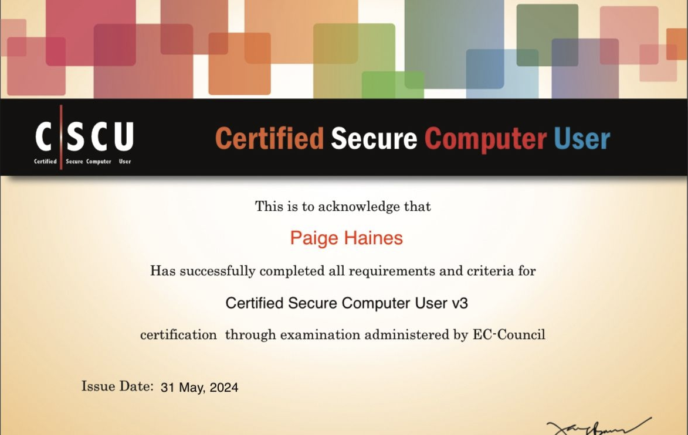
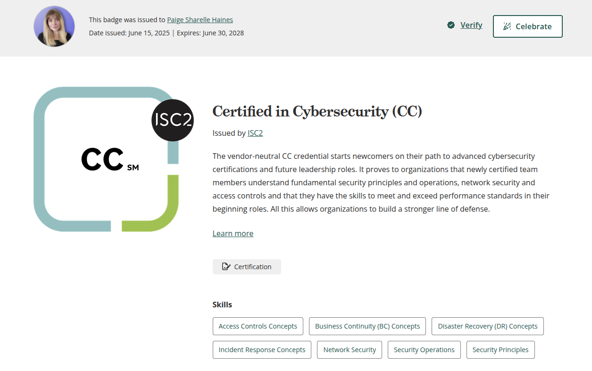
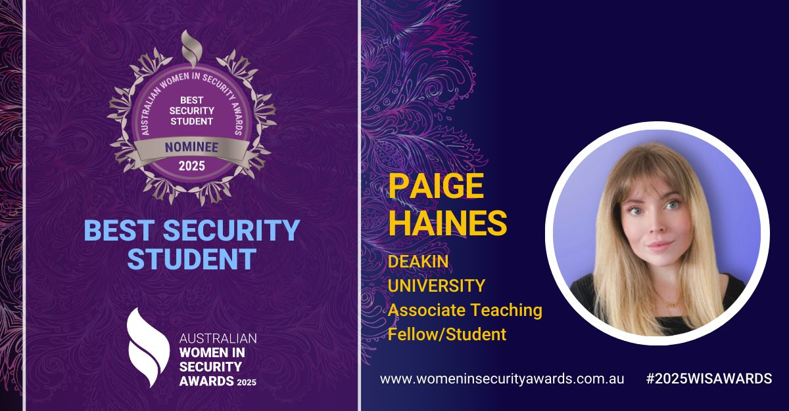
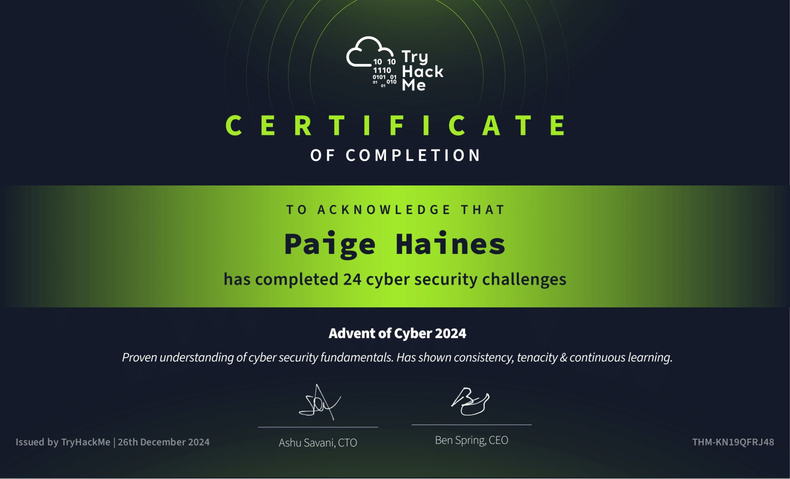
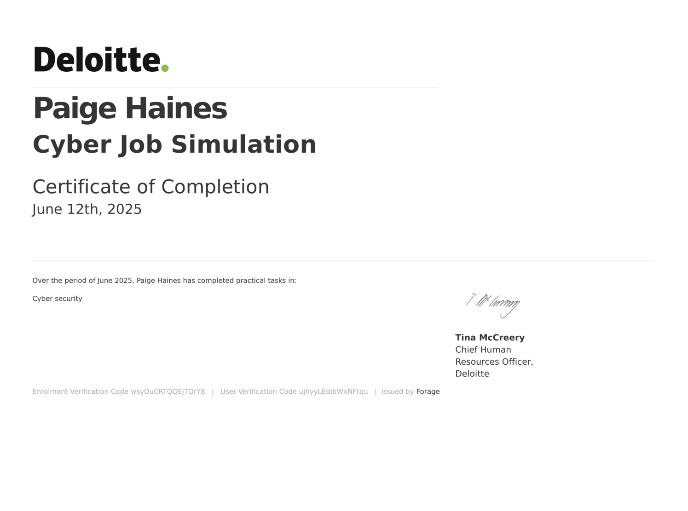

I am a **High-Distinction student** currently studying at Deakin University, with a **Weighted Average Mark (WAM) of 82.1**. My academic performance reflects a strong commitment to both theoretical knowledge and practical application, particularly in areas related to programming, mathematics, and cybersecurity.

#### Academic Results

| Unit Code | Unit Name                                          | Grade  | Mark |
|-----------|----------------------------------------------------|--------|------|
| SIT102    | Introduction to Programming                        | Distinction (D) | 75   |
| SIT111    | Computer Systems                                   | Distinction (D) | 70   |
| SIT182    | Real World Practices for Cyber Security            | High Distinction (HD) | 91   |
| SIT192    | Discrete Mathematics                               | High Distinction (HD) | 90   |
| SIT223    | Professional Practice in IT                        | High Distinction (HD) | 100  |
| SIT232    | Object-Oriented Development                        | High Distinction (HD) | 95   |

#### Extracurricular Involvement

In addition to my academic studies, I am also an **Assistant Secretary of the Deakin University Cybersecurity Association (DUCA)**. In this role, I contribute to the planning and execution of events, workshops, and mentoring programs aimed at developing cybersecurity skills among students and building a stronger cyber-aware community at Deakin.

---

I take pride in maintaining high academic standards while actively engaging with the cybersecurity community, striving to bridge the gap between technical expertise and real-world impact.

#### Certifications and Awards 
**Certified Secure Computer User (C/SCU)**  
*EC-Council — May 2024*  
Earned certification demonstrating a strong foundation in secure computer usage and best practices for protecting information systems.

  

**Certified in Cybersecurity (CC)**  
*ISC2 — June 2025*  
Earned certification demonstrating a solid understanding of fundamental cybersecurity principles and best practices to protect information systems and manage digital risks effectively.

  

**Best Security Student Nominee**  
*Australian Women in Security Awards — April 2025*  
Nominated for outstanding achievement as a security student, recognised by industry professionals. Proud to be involved with the Deakin University Cybersecurity Association (DUCA) and collaborate with organisations such as the Australian Women in Security Network (AWSN) and Women in CyberSecurity (WiCyS) Australia Affiliate, which provide invaluable support and mentorship for women pursuing careers in cybersecurity.

  

**24 Security Challenges — Advent of Cyber 2024**  
*TryHackMe — December 2024*  
Successfully completed a series of hands-on cybersecurity challenges encompassing blue, red, and purple team exercises, enhancing practical skills across multiple domains of cybersecurity during a focused month-long event.

  

**Deloitte — Cyber Job Simulation**  
*Forage — June 2025*  
Investigated a practical data breach on behalf of a client, answering relevant questions to demonstrate my understanding of the forensic analysis process.

  

