Welcome to my blog! Here you'll find a collection of posts exploring topics from cybersecurity and malware analysis to reflections on learning and creativity.

  

  

###### [Jujutsu Kaisen and Shifting the Balance With Social Engineering](posts/socialengineeringjjk.md)
*Sept 21, 2025*  

Bridging anime storytelling and cyber security concepts by analysing how Kenjaku’s impersonation and manipulation mirror real-world social engineering attacks.
*Psychological manipulation, human vulnerability, and security awareness.* 

---  

  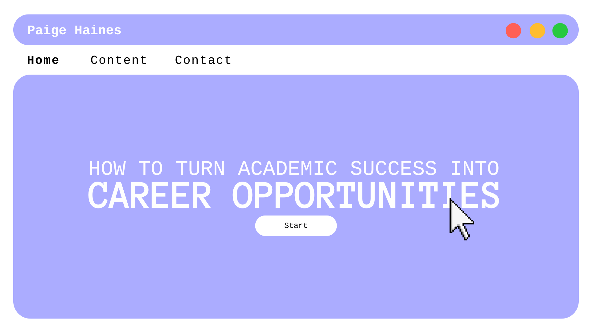

  

###### [How to Turn Academic Success into Career Opportunities](posts/careeropportunities.md)
*June 29, 2025*  
  
Built industry readiness as a high-achieving IT student by actively engaging in conferences, university clubs, and tech communities. 
*Career preparation, community engagement, and professional development.*

---  

  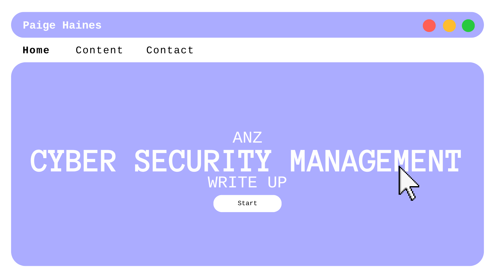

  

###### [ANZ Cyber Security Management Job Simulation Write Up](posts/anzcybermanagement.md)
*June 25, 2025*  
  
Completed a cybersecurity simulation with ANZ, identifying threats through packet capture investigation using open-source tools.  
*Threat detection, network traffic analysis, and digital forensics.*

---  

  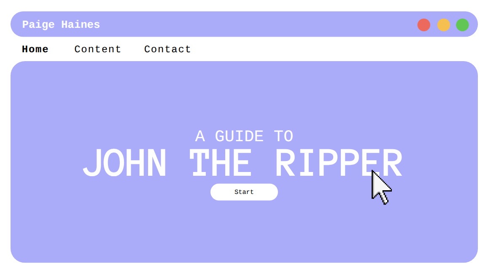

  

###### [A Guide to John the Ripper](posts/johntheripper.md)
*June 21, 2025*  
  
A quick cheat sheet for those who are interested in putting their development skills to the test. This cheat sheet provides the preliminary steps in setting up and deploying a GitHub Pages portfolio that you can use to show off your work.  
*Portfolio creation, cyber portfolio, and web development.*

---  

  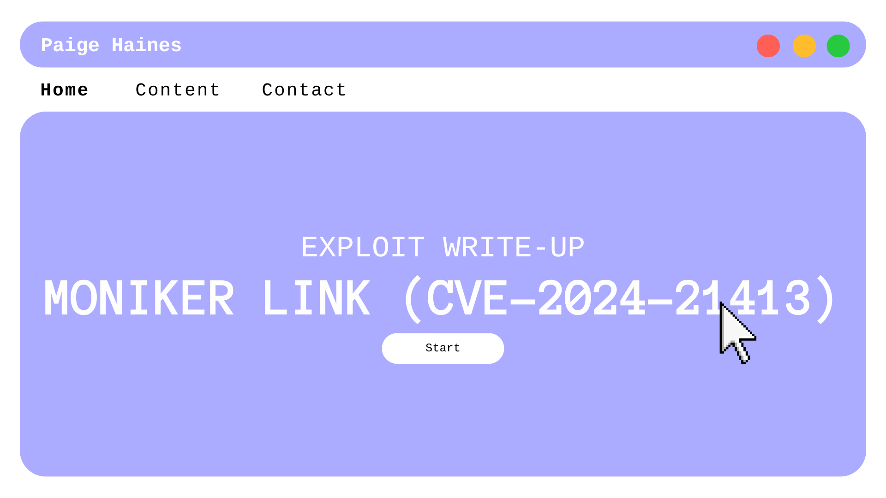

  

###### [Moniker Link (CVE-2024-21413) Exploit Write-Up](posts/moniker-link-writeup.md)
*June 20, 2025*
  
This writeup demonstrates how to exploit the Moniker Link vulnerability responsible for RCE and credential leak vulnerabilities.  
*Investigations, virtual machines, and vulnerability exploitation.*

---  

  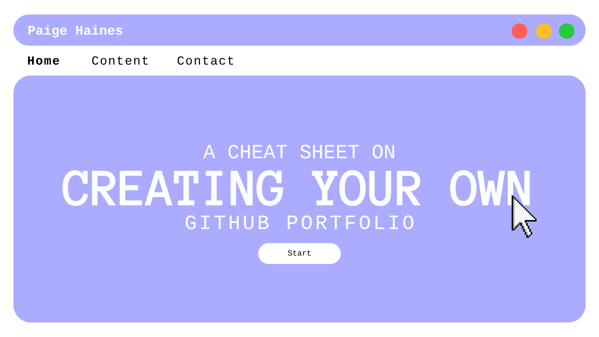

  

###### [A Cheat Sheet on How to Create Your Own GitHub Pages Portfolio](posts/create-your-portfolio.md)
*June 17, 2025*  
  
A quick cheat sheet for those who are interested in putting their development skills to the test. This cheat sheet provides the preliminary steps in setting up and deploying a GitHub Pages portfolio that you can use to show off your work.  
*Portfolio creation, cyber portfolio, and web development.*

---  

  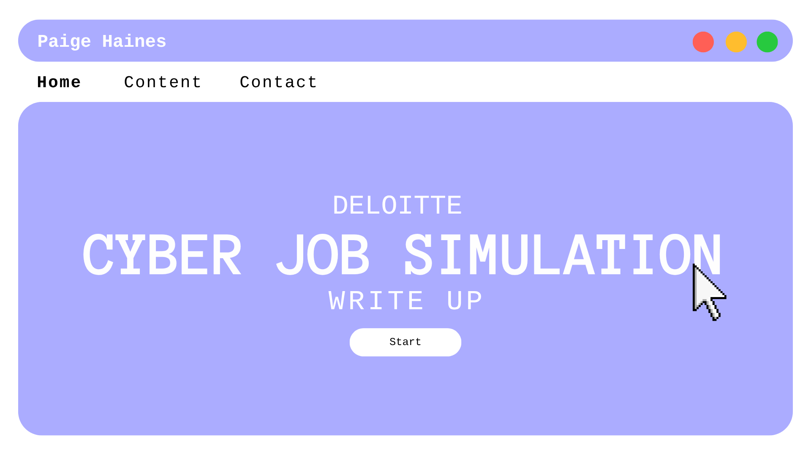

  

###### [Deloitte Cyber Job Simulation Write Up](posts/deloitte-write-up.md)
*June 13, 2025*  
  
A job simulation exercise that involved reading web activity logs, supporting a client in a cybersecurity breach, and providing analytical, data-based conclusions to identify suspicious user activity.  
*Threat analysis, cyber investigations, analysis of web logs, forensic report writing.*

---   

  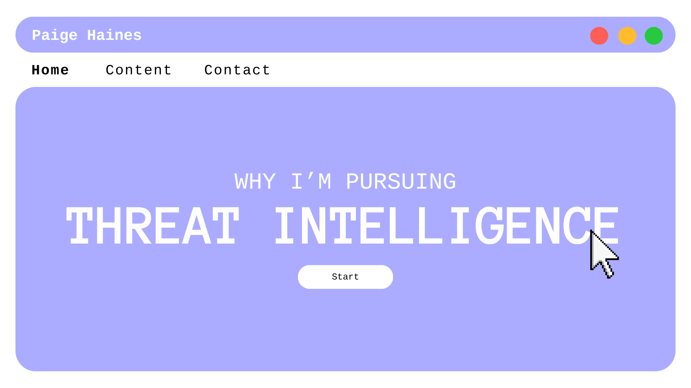

  

###### [Why I’m Pursuing Threat Intelligence](posts/why-threat-intel.md)
*June 12, 2025*  
  
Blending strong writing, analytical thinking, and an eye for detail to produce clear, actionable intelligence.  
*Threat reporting, technical communication, stakeholder-focused analysis, and cyber investigations.*

--- 

  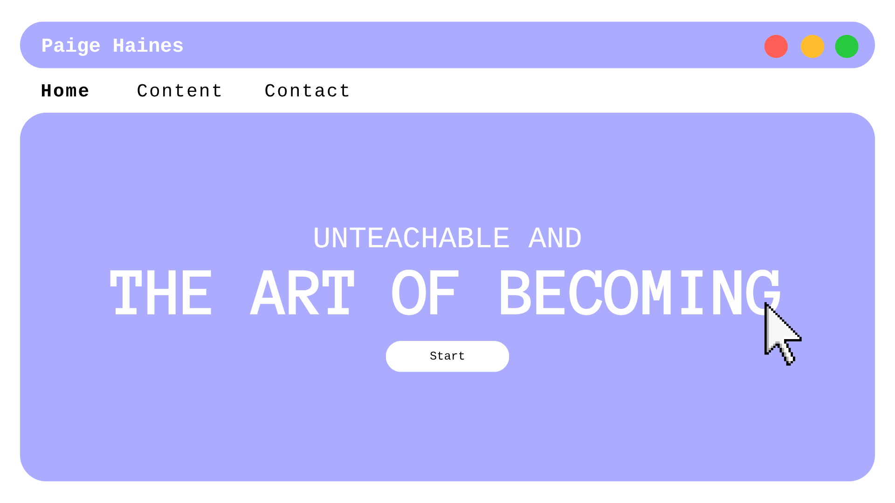

  

###### [Unteachable and the Art of Becoming](posts/unteachable.md)
*Nov 01, 2024*  
  
A personal reflection on what it means to learn, grow, and challenge fixed ideas of teachability.  
*Mathematical growth mindset, overcoming academic self-doubt, and the lifelong impact of compassionate teaching.*

--- 

  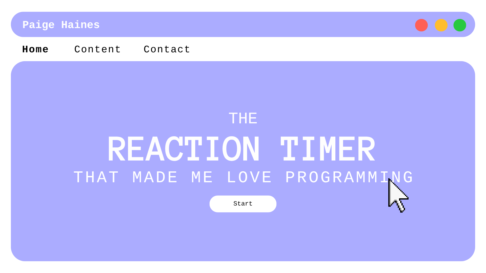

  

###### [The Reaction Timer That Made Me Love Programming](posts/reaction-timer.md)
*Sept 17, 2024*  
  
A beginner coding journey sparked by building a simple reaction timer and the unexpected joy that came with it.  
*Object-oriented design, finite state machines, and test-driven development with C#.*

--- 

  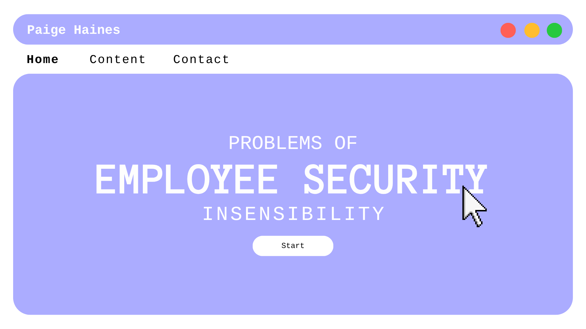

  

###### [Problems of Employee Security Insensibility](posts/employee-security-insensibility.md)
*July 02, 2024*  
  
A breakdown of common organisational security pitfalls and how human factors affect cybersecurity resilience.  
*Cybersecurity communication, policy critique, and behavioural risk evaluation in workplaces.*

--- 

  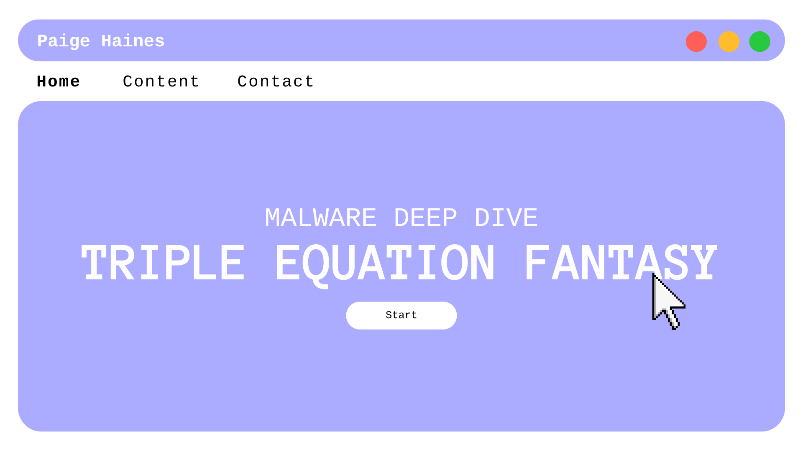

  

###### [Malware Deep Dive – Equation Triple Fantasy](posts/malware-deepdive.md)
*June 24, 2024*  
  
An investigation into one part of the highly sophisticated Equation Group APT.  
*Static analysis, threat intelligence, and reverse engineering insights.*