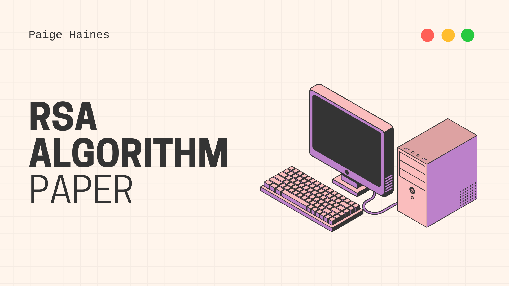
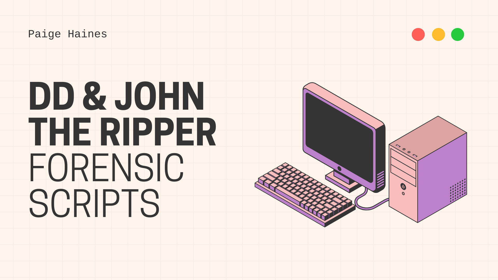
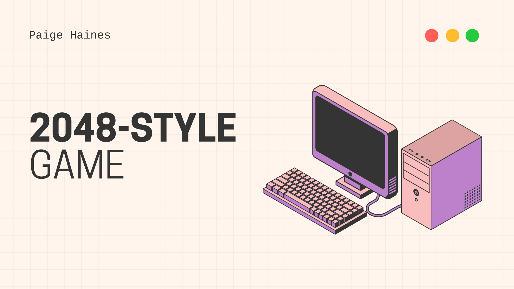
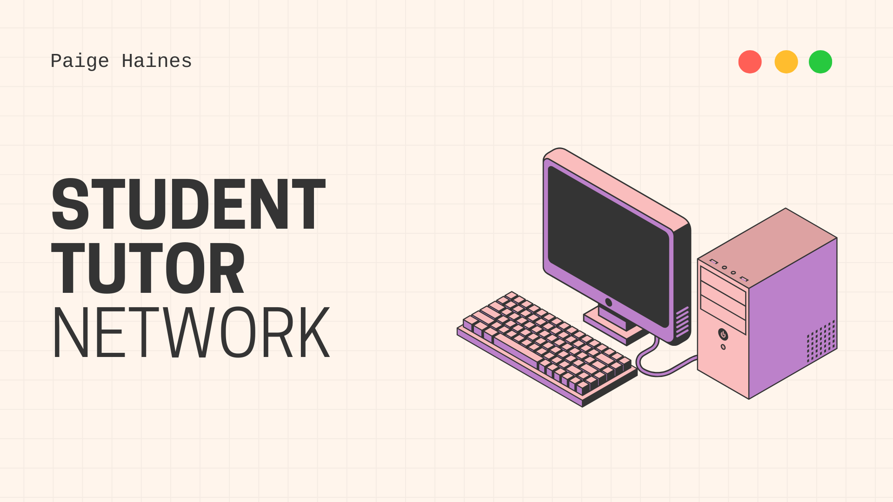
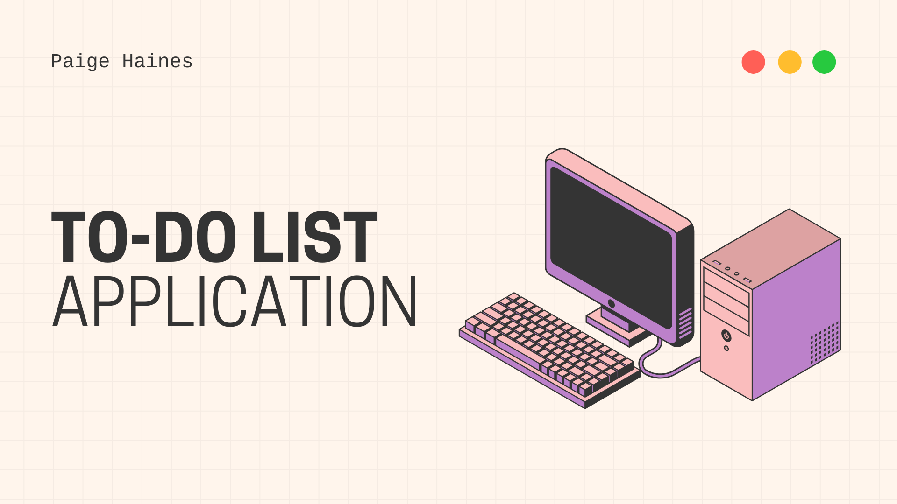

Over the years, I have found a passion for creating and developing programs in fields such as data analytics, gaming, and analysis. These projects have allowed me to expand my understanding of my coursework.

  

  

- [**Project 1:** Machine Learning Optimisation Analysis](https://github.com/paigehai/ml-optimisation)  
  An analysis that explores the application of different tuning techniques on a set of five machine learning algorithms.

  

  

- [**Project 2:** BlockCypher Plugin](https://github.com/paigehai/BlockCypher-Analysis-Plugin)  
  A plugin designed for use with BlockCypher, a blockchain tool. This plugin presents beautifully crafted visualisations for use alongside BlockCypher data.

  

  

- [**Project 3:** RSA Algorithm Paper](https://github.com/paigehai/RSA-Algorithm/blob/main/RSA-Algorithm.pdf)  
  A mathematical paper examining the RSA algorithm and its supporting concepts. This report explores its proof and provides engaging examples.

  

  

- [**Project 4:** dd and JohnTheRipper Forensic Scripts](https://github.com/paigehai/Forensics-Scripts)  
  Two scripts that were created to help with running *dd* and *John The Ripper*.

  

  

- [**Project 5:** 2048-Style Game](https://github.com/paigehai/Revised2048Game)  
  A game created using HTML, CSS, and JS with integrated unit testing, Docker health checks and a Jenkins pipeline.

  

  

- [**Project 6:** Student Tutor Network](https://github.com/paigehai/StudentTutorNetwork)  
  A C++ CLI application that allows students to easily connect with tutors for academic support.

  

  

- [**Project 7:** To-Do List Application](https://github.com/paigehai/ListfulToDoList)  
  A to-do list application with a visually pleasing interface, an experiment in combining design with functionality.
