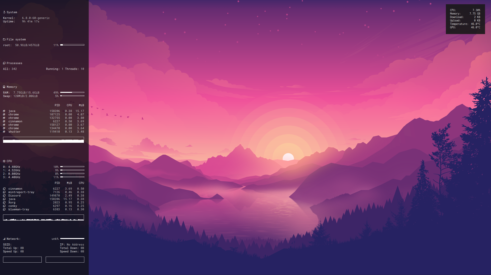

🤍 Based in Melbourne, I'm currently studying my Bachelor of Cyber Security at Deakin University, where I have gained so much insight into programming, security, and mathematics. I enjoy working with frameworks such as HTML, CSS, and JavaScript, and Python. When designing, I prefer to use Figma for prototyping, and Adobe Suite for graphic design.

In my spare time, I am usually being active and exploring nature, cooking up a delicious meal in the kitchen or hard at work learning something new in the cyber world! 💻 

---

#### A Work in Progress
My growth as a student have been highlighted by many key accomplishments, such as my mathematics paper written on the RSA encryption algorithm, my machine learning exploration, and my forensic plugin tool. You can find out more about my specific academic achievements in my [academia](academia.md) section. 

I am currently focusing on exploring more practical applications of cybersecurity alongside my studies where I explore different exploits, subsequently writing [reports](blog/index.md) on my findings.

---

#### Projects

Throughout my studies, I have been able to engage in many tasks that have allowed me the opportunity to expand my knowledge, beyond the standard degree. My best work can be viewed below.

- [**Project 1:** Machine Learning Optimisation Analysis](https://github.com/paigehai/ml-optimisation)  
  An analysis that explores the application of different tuning techniques on a set of five machine learning algorithms.

- [**Project 2:** BlockCypher Plugin](https://github.com/paigehai/BlockCypher-Analysis-Plugin)  
  A plugin designed for use with BlockCypher, a blockchain tool. This plugin presents beautifully crafted visualisations for use alongside BlockCypher data.

- [**Project 3:** RSA Algorithm Paper](https://github.com/paigehai/RSA-Algorithm/blob/main/RSA-Algorithm.pdf)  
  A mathematical paper examining the RSA algorithm and its supporting concepts. This report explores its proof and provides engaging examples.

For more projects, explore my [projects overview](projectsoverview/index.md)!

---

#### Skills
My skills are largely involved with industry-relevant forensic tools such as Autopsy, Wireshark, FTK Imager, Volatility, Ghidra and BlockCypher. I am proficient in languages C++, C#, and HTML/CSS/JavaScript. I am developing my skills in Python. 

  

I have also recently moved from Windows to Linux as I wanted to explore a more open-source approach to my workflow. I decided on Linux Mint, due to the ease of implementation!

  

I am an **Associate Teaching Fellow with Deakin University** as I have a passion for assisting other students and sharing knowledge. As a result, I have created many [videos](teaching.md) to guide students through common areas of difficulty.

#### Certifications

**Certified Secure Computer User (C/SCU)**  
*EC-Council — May 2024*  
Earned certification demonstrating a strong foundation in secure computer usage and best practices for protecting information systems.

  

**Certified in Cybersecurity (CC)**  
*ISC2 — June 2025*  
Earned certification demonstrating a solid understanding of fundamental cybersecurity principles and best practices to protect information systems and manage digital risks effectively.

  

#### Let's Connect!
- [LinkedIn](https://www.linkedin.com/in/paigehai/)
