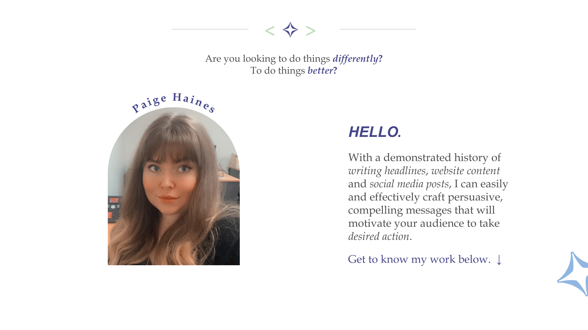
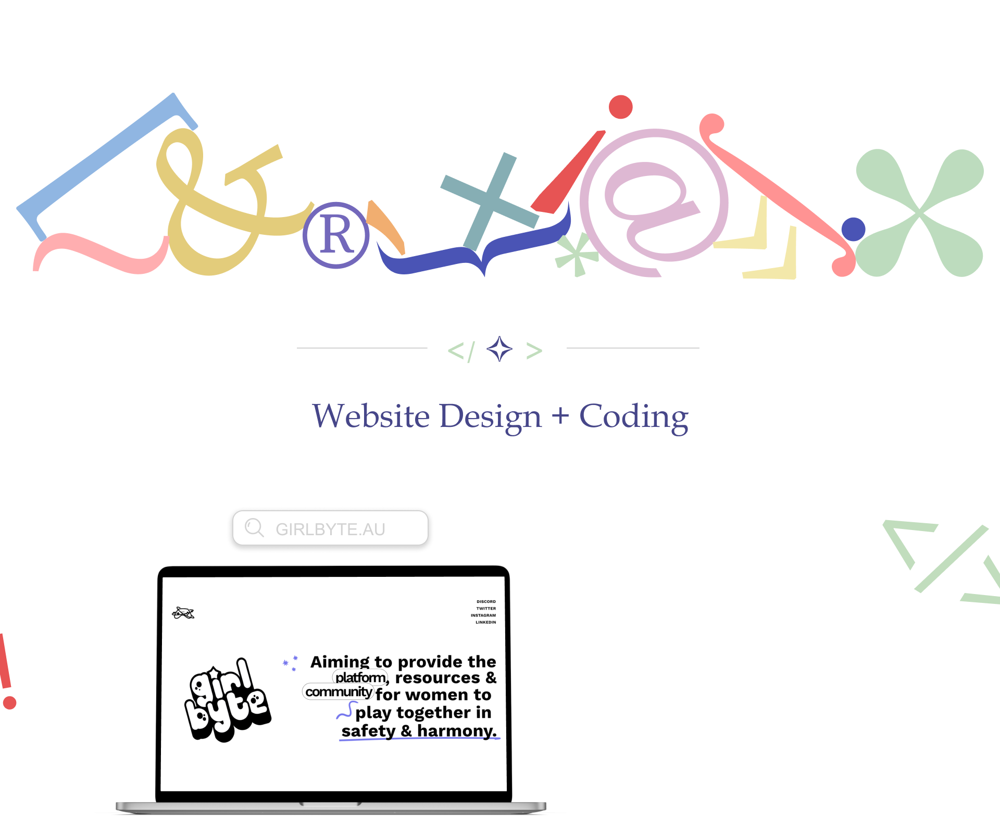
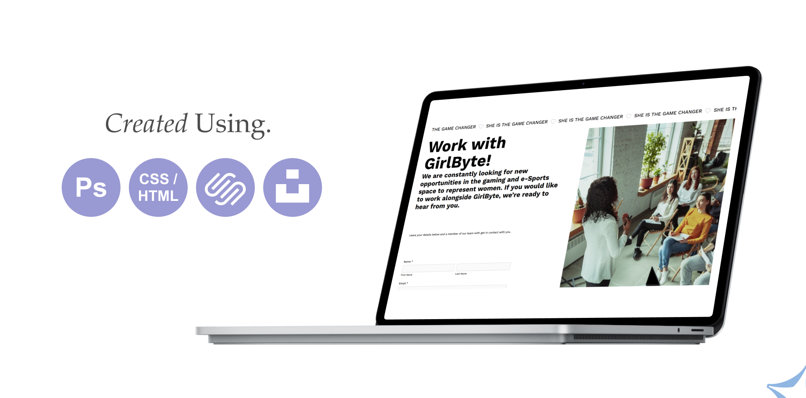
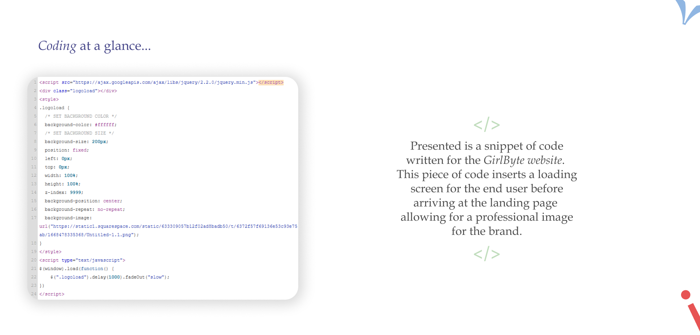
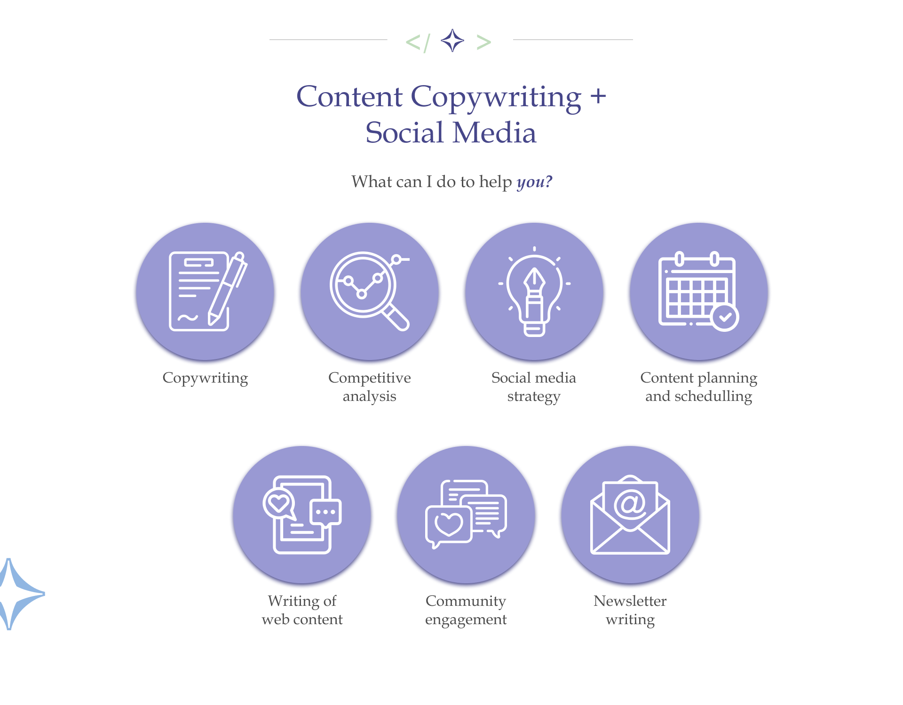
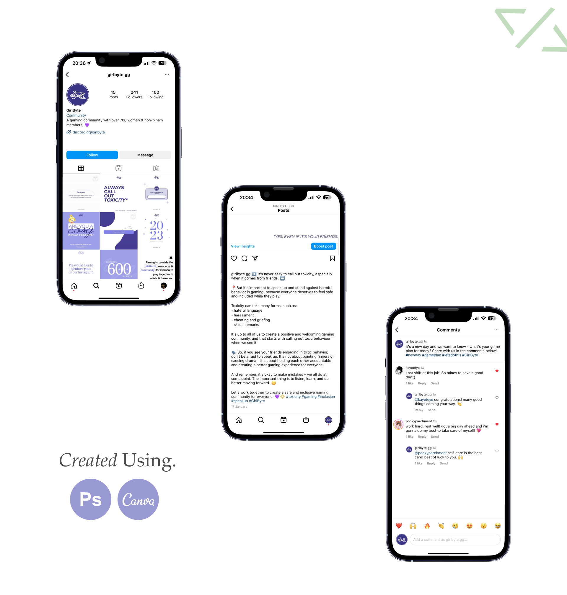
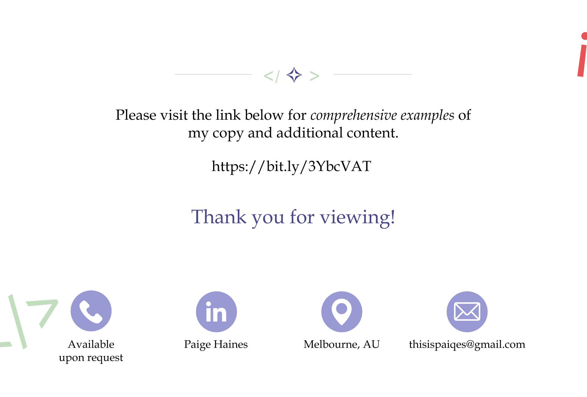
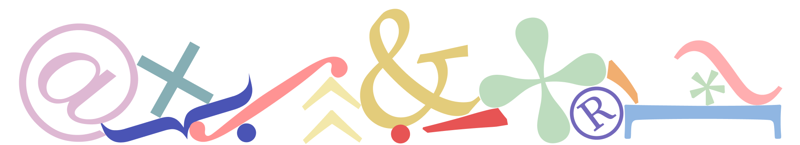

As part of my writing work, I was fortunate enough to engage in many social initiatives as a volunteer to expand my skills. One of these initiatives was the creation and posting of content for a community I founded, focusing on women in gaming. In this community, I worked on creating a website, drafting, and schedulling social content, and community engagement efforts. 

Click [here](girlbyte.md) to explore more about the GirlByte website in detail.  

 
  
**Please note:** the email address listed in this portfolio is no longer in use. Please contact me at [thisispaigehai@gmail.com](mailto:thisispaigehai@gmail.com) for any inquiries.
