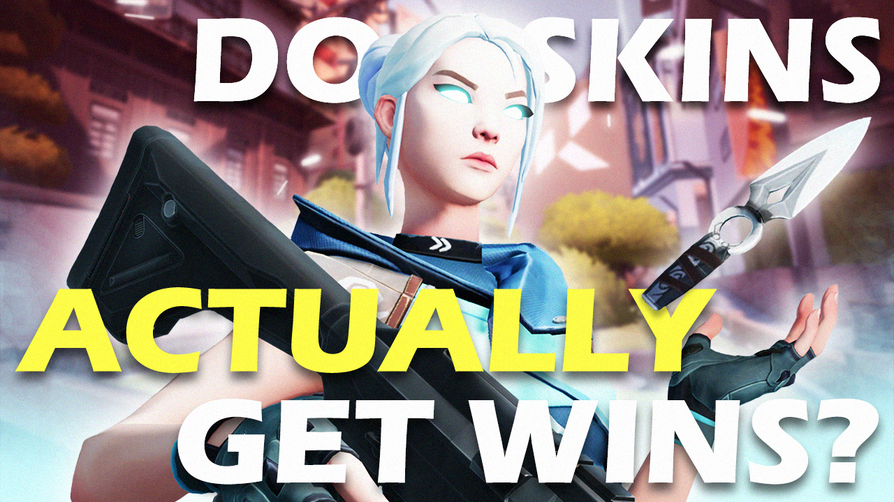
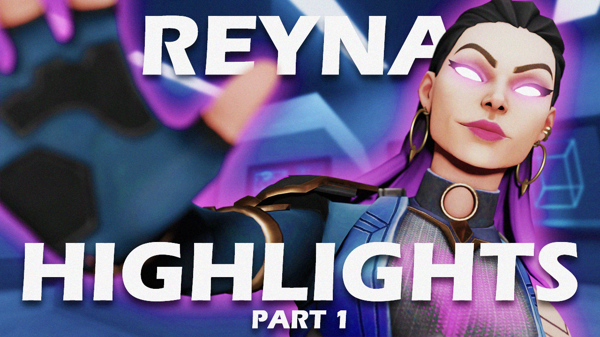
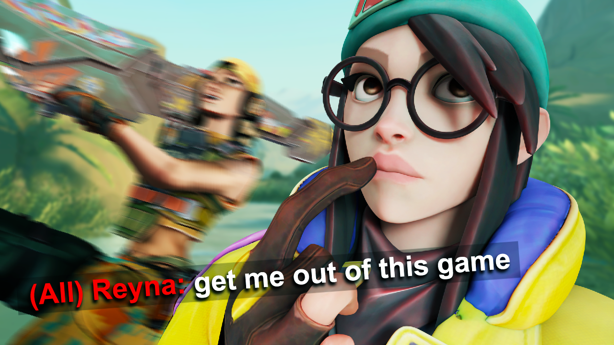

This was a passion project where I combined my love for gaming with my design skills. I created a collection of YouTube thumbnails themed around [Valorant](https://playvalorant.com), using both Photoshop and Blender. The 3D models were taken straight from the game, and I used them to create eye-catching compositions that blend gameplay excitement with strong visual storytelling.

  
  

